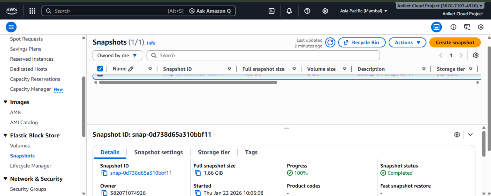
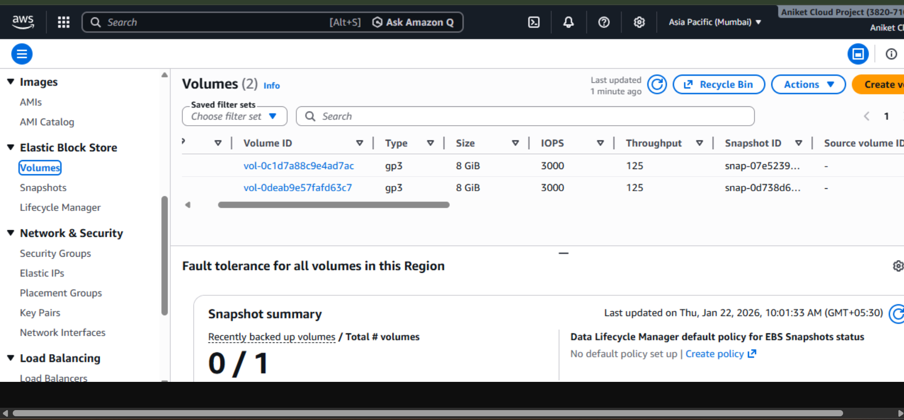
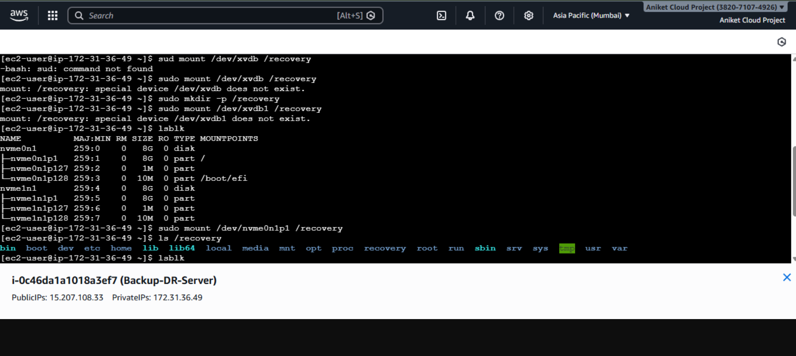

# AWS-Disaster-Recovery

**Project Overview**
This project demonstrates how to implement Backup and Disaster Recovery on AWS using EC2 and EBS Snapshots.
The goal was to safely back up an EC2 instance, simulate data loss, and successfully restore the system using snapshots.

**Technologies Used**
> Amazon EC2

> Amazon EBS

> EBS Snapshots

> Linux (Amazon Linux 2023)

> AWS Management Console

> AWS EC2 Instance Connect

**Project Objectives**
- Create a reliable backup of EC2 data using EBS snapshots
- Restore data from snapshots in case of failure
- Attach restored volumes to a recovery instance
- Verify data recovery using Linux commands.

**Architecture**
  EC2 Instance
   |
   |--> EBS Volume
           |
           |--> Snapshot (Backup)
                     |
                     |--> New Volume (Recovery)
                               |
                               |--> Attached to EC2

**Step-by-Step Implementation**

1️⃣ EC2 Instance Setup

Launched an EC2 instance in ap-south-1 (Mumbai) region
Installed Apache server and stored sample data

2️⃣ Create EBS Snapshot (Backup)

### EBS Snapshot Backup

3️⃣ Restore Volume from Snapshot

### Restore Volume

4️⃣ Attach Volume to Recovery Instance

Attached restored volume to EC2 as a secondary disk
AWS NVMe device mapping observed

5️⃣ Mount Restored Volume (Recovery)

### Mount Restored Volume

**Challenge Faced & Solution**

Issue:
Mount failed using legacy device name /dev/xvdb1

Root Cause:
AWS Nitro instances expose volumes as NVMe devices

Solution:
Used lsblk to identify correct device (/dev/nvme1n1p1) and mounted successfully

## Result

Successfully backed up and restored EC2 data using EBS snapshots with minimal downtime and validated recovery using Linux commands.

## Screenshots

### EBS Snapshot Backup

.png)

### Restore Volume from Snapshot

### Mount Restored Volume

.png)

